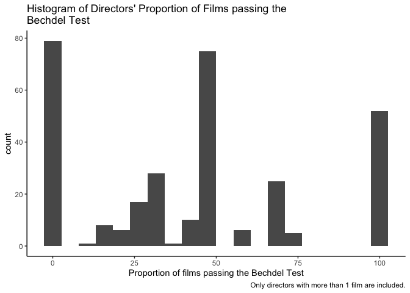

This is my first attempt at using `tidymodels` and the first time I'm using `stacks`. I'm going to be copying and pasting a lot of code from the online guides (which I should reference).


```r
library(tidyverse) # data manipulation
```

```
## ── Attaching packages ─────────────────────────────────────── tidyverse 1.3.0 ──
```

```
## ✓ ggplot2 3.3.3     ✓ purrr   0.3.4
## ✓ tibble  3.1.0     ✓ dplyr   1.0.5
## ✓ tidyr   1.1.3     ✓ stringr 1.4.0
## ✓ readr   1.4.0     ✓ forcats 0.5.1
```

```
## ── Conflicts ────────────────────────────────────────── tidyverse_conflicts() ──
## x dplyr::filter() masks stats::filter()
## x dplyr::lag()    masks stats::lag()
```

```r
library(tidytuesdayR) # Tidy Tuesday data
library(tidymodels) # Modeling!
```

```
## ── Attaching packages ────────────────────────────────────── tidymodels 0.1.2 ──
```

```
## ✓ broom     0.7.5      ✓ recipes   0.1.15
## ✓ dials     0.0.9      ✓ rsample   0.0.9 
## ✓ infer     0.5.4      ✓ tune      0.1.3 
## ✓ modeldata 0.1.0      ✓ workflows 0.2.1 
## ✓ parsnip   0.1.5      ✓ yardstick 0.0.7
```

```
## ── Conflicts ───────────────────────────────────────── tidymodels_conflicts() ──
## x scales::discard() masks purrr::discard()
## x dplyr::filter()   masks stats::filter()
## x recipes::fixed()  masks stringr::fixed()
## x dplyr::lag()      masks stats::lag()
## x yardstick::spec() masks readr::spec()
## x recipes::step()   masks stats::step()
```

```r
library(stacks) # Ensemble methods
library(gt) # html tables
theme_set(theme_classic())
```

I'm using the `readr` package to pull the files from github since the Tidy Tuesday tt_load() wasn't working for me.


```r
#tuesdata <- tidytuesdayR::tt_load(2021, week= 11)

raw_bechdel <- readr::read_csv('https://raw.githubusercontent.com/rfordatascience/tidytuesday/master/data/2021/2021-03-09/raw_bechdel.csv')
```

```
## 
## ── Column specification ────────────────────────────────────────────────────────
## cols(
##   year = col_double(),
##   id = col_double(),
##   imdb_id = col_character(),
##   title = col_character(),
##   rating = col_double()
## )
```

```r
movies <- readr::read_csv('https://raw.githubusercontent.com/rfordatascience/tidytuesday/master/data/2021/2021-03-09/movies.csv')
```

```
## 
## ── Column specification ────────────────────────────────────────────────────────
## cols(
##   .default = col_character(),
##   year = col_double(),
##   budget = col_double(),
##   budget_2013 = col_double(),
##   period_code = col_double(),
##   decade_code = col_double(),
##   response = col_logical(),
##   metascore = col_double(),
##   imdb_rating = col_double(),
##   imdb_votes = col_number(),
##   error = col_logical()
## )
## ℹ Use `spec()` for the full column specifications.
```


```r
glimpse(raw_bechdel)
glimpse(movies)
```

I'm not going to display the data here... just because.

I want to create a full data set that contains as many variables as I can have to predict which movies passed the Bechdel test.

Make full join to keep all the variables!


```r
bechdel_movies <- raw_bechdel %>% 
  full_join(movies, by = c("imdb_id" = "imdb_id", "year" = "year", "title" = "title"))
```


```r
glimpse(bechdel_movies)
```


```r
## prioritize the bechdel data

raw_bechdel %>% 
  filter(year == 2000) %>% 
  count() # 152

movies %>% 
  filter(year == 2000) %>% 
  count() # 63

bechdel_movies %>% 
  filter(year == 2000) %>% 
  count() # 154
```

### Quick look at directors

Who are the directors with the highest proportion of movies that pass the Bechdel test?

I might have to filter out those with only one movie, but we can see how many have only 1 movie directed that passes the Bechdel test.


```r
director_bechdel <- bechdel_movies %>% 
  filter(!is.na(director)) %>% 
  group_by(director) %>% 
  summarize(num_movies = n(),
    num_bechdel = sum(ifelse(binary == "PASS", 1, 0), na.rm = T), .groups = "keep") %>% 
  mutate(bechdel_prop = round((num_bechdel/num_movies) * 100, 2)) %>% 
  arrange(desc(bechdel_prop)) %>% 
  filter(num_movies > 1) %>% 
  select(director, bechdel_prop, num_movies)
```


```r
ggplot(director_bechdel, aes(bechdel_prop)) +
  geom_histogram(bins = 20) +
  labs(title = str_wrap("Histogram of Directors' Proportion of Films passing the Bechdel Test", 60),
       x = "Proportion of films passing the Bechdel Test",
       caption = "Only directors with more than 1 film are included.")
```

<!-- -->

There are over 50 directors that have directed more than one film that have a 100% pass-rate on the Bechdel Test. This is a simple graph, but due to the fact that most directors are excluded, we can explore another set of variables that might provide some more predictive power.

## Predicting Bechdel based on...?

There are a ton of missing data that needs to be taken care of (n = 7113). Most movies after 2013 have not been coded whether or not they have passed the Bechdel test. (What?!) We'll just remove those and work with the 991 FAILs and 803 PASSs. The missing values after 2013 and prior to 1970 are worrisome. Come on Bechdel testers, start watching more films!


```r
# Binary Logistic
bechdel_movies %>% 
  count(year, binary) %>%
  gt_preview(top_n = 5, bottom_n = 5, incl_rownums = F) %>% 
  tab_header(title = "Top and Bottom years", subtitle = "Quick peek at missing data at the extreme years.")
```

```
## Warning: The `.dots` argument of `group_by()` is deprecated as of dplyr 1.0.0.
```

```{=html}
<style>html {
  font-family: -apple-system, BlinkMacSystemFont, 'Segoe UI', Roboto, Oxygen, Ubuntu, Cantarell, 'Helvetica Neue', 'Fira Sans', 'Droid Sans', Arial, sans-serif;
}

#eojglrtzur .gt_table {
  display: table;
  border-collapse: collapse;
  margin-left: auto;
  margin-right: auto;
  color: #333333;
  font-size: 16px;
  font-weight: normal;
  font-style: normal;
  background-color: #FFFFFF;
  width: auto;
  border-top-style: solid;
  border-top-width: 2px;
  border-top-color: #A8A8A8;
  border-right-style: none;
  border-right-width: 2px;
  border-right-color: #D3D3D3;
  border-bottom-style: solid;
  border-bottom-width: 2px;
  border-bottom-color: #A8A8A8;
  border-left-style: none;
  border-left-width: 2px;
  border-left-color: #D3D3D3;
}

#eojglrtzur .gt_heading {
  background-color: #FFFFFF;
  text-align: center;
  border-bottom-color: #FFFFFF;
  border-left-style: none;
  border-left-width: 1px;
  border-left-color: #D3D3D3;
  border-right-style: none;
  border-right-width: 1px;
  border-right-color: #D3D3D3;
}

#eojglrtzur .gt_title {
  color: #333333;
  font-size: 125%;
  font-weight: initial;
  padding-top: 4px;
  padding-bottom: 4px;
  border-bottom-color: #FFFFFF;
  border-bottom-width: 0;
}

#eojglrtzur .gt_subtitle {
  color: #333333;
  font-size: 85%;
  font-weight: initial;
  padding-top: 0;
  padding-bottom: 4px;
  border-top-color: #FFFFFF;
  border-top-width: 0;
}

#eojglrtzur .gt_bottom_border {
  border-bottom-style: solid;
  border-bottom-width: 2px;
  border-bottom-color: #D3D3D3;
}

#eojglrtzur .gt_col_headings {
  border-top-style: solid;
  border-top-width: 2px;
  border-top-color: #D3D3D3;
  border-bottom-style: solid;
  border-bottom-width: 2px;
  border-bottom-color: #D3D3D3;
  border-left-style: none;
  border-left-width: 1px;
  border-left-color: #D3D3D3;
  border-right-style: none;
  border-right-width: 1px;
  border-right-color: #D3D3D3;
}

#eojglrtzur .gt_col_heading {
  color: #333333;
  background-color: #FFFFFF;
  font-size: 100%;
  font-weight: normal;
  text-transform: inherit;
  border-left-style: none;
  border-left-width: 1px;
  border-left-color: #D3D3D3;
  border-right-style: none;
  border-right-width: 1px;
  border-right-color: #D3D3D3;
  vertical-align: bottom;
  padding-top: 5px;
  padding-bottom: 6px;
  padding-left: 5px;
  padding-right: 5px;
  overflow-x: hidden;
}

#eojglrtzur .gt_column_spanner_outer {
  color: #333333;
  background-color: #FFFFFF;
  font-size: 100%;
  font-weight: normal;
  text-transform: inherit;
  padding-top: 0;
  padding-bottom: 0;
  padding-left: 4px;
  padding-right: 4px;
}

#eojglrtzur .gt_column_spanner_outer:first-child {
  padding-left: 0;
}

#eojglrtzur .gt_column_spanner_outer:last-child {
  padding-right: 0;
}

#eojglrtzur .gt_column_spanner {
  border-bottom-style: solid;
  border-bottom-width: 2px;
  border-bottom-color: #D3D3D3;
  vertical-align: bottom;
  padding-top: 5px;
  padding-bottom: 6px;
  overflow-x: hidden;
  display: inline-block;
  width: 100%;
}

#eojglrtzur .gt_group_heading {
  padding: 8px;
  color: #333333;
  background-color: #FFFFFF;
  font-size: 100%;
  font-weight: initial;
  text-transform: inherit;
  border-top-style: solid;
  border-top-width: 2px;
  border-top-color: #D3D3D3;
  border-bottom-style: solid;
  border-bottom-width: 2px;
  border-bottom-color: #D3D3D3;
  border-left-style: none;
  border-left-width: 1px;
  border-left-color: #D3D3D3;
  border-right-style: none;
  border-right-width: 1px;
  border-right-color: #D3D3D3;
  vertical-align: middle;
}

#eojglrtzur .gt_empty_group_heading {
  padding: 0.5px;
  color: #333333;
  background-color: #FFFFFF;
  font-size: 100%;
  font-weight: initial;
  border-top-style: solid;
  border-top-width: 2px;
  border-top-color: #D3D3D3;
  border-bottom-style: solid;
  border-bottom-width: 2px;
  border-bottom-color: #D3D3D3;
  vertical-align: middle;
}

#eojglrtzur .gt_from_md > :first-child {
  margin-top: 0;
}

#eojglrtzur .gt_from_md > :last-child {
  margin-bottom: 0;
}

#eojglrtzur .gt_row {
  padding-top: 8px;
  padding-bottom: 8px;
  padding-left: 5px;
  padding-right: 5px;
  margin: 10px;
  border-top-style: solid;
  border-top-width: 1px;
  border-top-color: #D3D3D3;
  border-left-style: none;
  border-left-width: 1px;
  border-left-color: #D3D3D3;
  border-right-style: none;
  border-right-width: 1px;
  border-right-color: #D3D3D3;
  vertical-align: middle;
  overflow-x: hidden;
}

#eojglrtzur .gt_stub {
  color: #333333;
  background-color: #FFFFFF;
  font-size: 100%;
  font-weight: initial;
  text-transform: inherit;
  border-right-style: solid;
  border-right-width: 2px;
  border-right-color: #D3D3D3;
  padding-left: 12px;
}

#eojglrtzur .gt_summary_row {
  color: #333333;
  background-color: #FFFFFF;
  text-transform: inherit;
  padding-top: 8px;
  padding-bottom: 8px;
  padding-left: 5px;
  padding-right: 5px;
}

#eojglrtzur .gt_first_summary_row {
  padding-top: 8px;
  padding-bottom: 8px;
  padding-left: 5px;
  padding-right: 5px;
  border-top-style: solid;
  border-top-width: 2px;
  border-top-color: #D3D3D3;
}

#eojglrtzur .gt_grand_summary_row {
  color: #333333;
  background-color: #FFFFFF;
  text-transform: inherit;
  padding-top: 8px;
  padding-bottom: 8px;
  padding-left: 5px;
  padding-right: 5px;
}

#eojglrtzur .gt_first_grand_summary_row {
  padding-top: 8px;
  padding-bottom: 8px;
  padding-left: 5px;
  padding-right: 5px;
  border-top-style: double;
  border-top-width: 6px;
  border-top-color: #D3D3D3;
}

#eojglrtzur .gt_striped {
  background-color: rgba(128, 128, 128, 0.05);
}

#eojglrtzur .gt_table_body {
  border-top-style: solid;
  border-top-width: 2px;
  border-top-color: #D3D3D3;
  border-bottom-style: solid;
  border-bottom-width: 2px;
  border-bottom-color: #D3D3D3;
}

#eojglrtzur .gt_footnotes {
  color: #333333;
  background-color: #FFFFFF;
  border-bottom-style: none;
  border-bottom-width: 2px;
  border-bottom-color: #D3D3D3;
  border-left-style: none;
  border-left-width: 2px;
  border-left-color: #D3D3D3;
  border-right-style: none;
  border-right-width: 2px;
  border-right-color: #D3D3D3;
}

#eojglrtzur .gt_footnote {
  margin: 0px;
  font-size: 90%;
  padding: 4px;
}

#eojglrtzur .gt_sourcenotes {
  color: #333333;
  background-color: #FFFFFF;
  border-bottom-style: none;
  border-bottom-width: 2px;
  border-bottom-color: #D3D3D3;
  border-left-style: none;
  border-left-width: 2px;
  border-left-color: #D3D3D3;
  border-right-style: none;
  border-right-width: 2px;
  border-right-color: #D3D3D3;
}

#eojglrtzur .gt_sourcenote {
  font-size: 90%;
  padding: 4px;
}

#eojglrtzur .gt_left {
  text-align: left;
}

#eojglrtzur .gt_center {
  text-align: center;
}

#eojglrtzur .gt_right {
  text-align: right;
  font-variant-numeric: tabular-nums;
}

#eojglrtzur .gt_font_normal {
  font-weight: normal;
}

#eojglrtzur .gt_font_bold {
  font-weight: bold;
}

#eojglrtzur .gt_font_italic {
  font-style: italic;
}

#eojglrtzur .gt_super {
  font-size: 65%;
}

#eojglrtzur .gt_footnote_marks {
  font-style: italic;
  font-size: 65%;
}
</style>
<div id="eojglrtzur" style="overflow-x:auto;overflow-y:auto;width:auto;height:auto;"><table class="gt_table">
  <thead class="gt_header">
    <tr>
      <th colspan="3" class="gt_heading gt_title gt_font_normal" style>Top and Bottom years</th>
    </tr>
    <tr>
      <th colspan="3" class="gt_heading gt_subtitle gt_font_normal gt_bottom_border" style>Quick peek at missing data at the extreme years.</th>
    </tr>
  </thead>
  <thead class="gt_col_headings">
    <tr>
      <th class="gt_col_heading gt_columns_bottom_border gt_right" rowspan="1" colspan="1">year</th>
      <th class="gt_col_heading gt_columns_bottom_border gt_left" rowspan="1" colspan="1">binary</th>
      <th class="gt_col_heading gt_columns_bottom_border gt_center" rowspan="1" colspan="1">n</th>
    </tr>
  </thead>
  <tbody class="gt_table_body">
    <tr>
      <td class="gt_row gt_right">1888</td>
      <td class="gt_row gt_left">NA</td>
      <td class="gt_row gt_center">1</td>
    </tr>
    <tr>
      <td class="gt_row gt_right">1892</td>
      <td class="gt_row gt_left">NA</td>
      <td class="gt_row gt_center">1</td>
    </tr>
    <tr>
      <td class="gt_row gt_right">1895</td>
      <td class="gt_row gt_left">NA</td>
      <td class="gt_row gt_center">2</td>
    </tr>
    <tr>
      <td class="gt_row gt_right">1896</td>
      <td class="gt_row gt_left">NA</td>
      <td class="gt_row gt_center">4</td>
    </tr>
    <tr>
      <td class="gt_row gt_right">1897</td>
      <td class="gt_row gt_left">NA</td>
      <td class="gt_row gt_center">1</td>
    </tr>
    <tr>
      <td class="gt_row gt_right" style="background-color: #E4E4E4;"></td>
      <td class="gt_row gt_left" style="background-color: #E4E4E4;"></td>
      <td class="gt_row gt_center" style="background-color: #E4E4E4;"></td>
    </tr>
    <tr>
      <td class="gt_row gt_right">2017</td>
      <td class="gt_row gt_left">NA</td>
      <td class="gt_row gt_center">267</td>
    </tr>
    <tr>
      <td class="gt_row gt_right">2018</td>
      <td class="gt_row gt_left">NA</td>
      <td class="gt_row gt_center">231</td>
    </tr>
    <tr>
      <td class="gt_row gt_right">2019</td>
      <td class="gt_row gt_left">NA</td>
      <td class="gt_row gt_center">218</td>
    </tr>
    <tr>
      <td class="gt_row gt_right">2020</td>
      <td class="gt_row gt_left">NA</td>
      <td class="gt_row gt_center">98</td>
    </tr>
    <tr>
      <td class="gt_row gt_right">2021</td>
      <td class="gt_row gt_left">NA</td>
      <td class="gt_row gt_center">6</td>
    </tr>
  </tbody>
  
  
</table></div>
```

```r
### Use binary for now.

# multinomial Logistic
# bechdel_movies %>%
#   count(clean_test)

# multinomial Logistic
# bechdel_movies %>% 
#   count(test)
```

Here is the clean data. I also create a new variable called `totalgross_2013`, which is just a simple sum of domestic and international gross (2013 adjusted). I should probably just keep the domestic and international gross, but the imputation isn't working as expected and I need complete data for the models.


```r
# filter

bechdel_movies_binary <- bechdel_movies %>% 
  filter(!is.na(binary) & !is.na(rating) & !is.na(imdb_rating)) %>% 
  mutate(binary = as.factor(binary),
         across(c(domgross_2013, intgross_2013), as.numeric)) %>% 
  rowwise() %>% 
  mutate(totalgross_2013 = mean(domgross_2013, intgross_2013, na.rm = T)) %>% 
  ungroup() %>% 
  select(binary, year, budget_2013, totalgross_2013, rating, imdb_rating)
```

```
## Warning in mask$eval_all_mutate(quo): NAs introduced by coercion

## Warning in mask$eval_all_mutate(quo): NAs introduced by coercion
```

```r
psych::describe(bechdel_movies_binary)

skimr::skim(bechdel_movies_binary)
# I can attempt to impute totalgross_2013
```


In order to perform predictive modeling, the data set has to be split into training and test sets. This allows us to build and evaluate a model on training data, while withholding a test set. After the model is properly tuned, it can be assessed using the test set. This helps check for the model's generalizabilty and gives us a clue to if we are over-fitting or under-fitting a model.


```r
# split
set.seed(64) # set seed for reproducibilty
bechdel_split <- initial_split(bechdel_movies_binary, strata = binary)
bechdel_train <- training(bechdel_split)
bechdel_test <- testing(bechdel_split)

# validation
#bechdel_val <- validation_split(bechdel_train, strata = binary, prop = .8)
```


Here I am building a "recipe" that will set up the model and do some pre-processing of data. This recipe can be used for to replicate the same steps for different models. I'm dummy coding nominal data, imputing the two continuous variables (domestic and international gross), removing predictors with no variance, and normalizing all predictors.

I have also selected a set of metrics I want to include in my assessment of the models.


```r
set.seed(64)
folds <- rsample::vfold_cv(bechdel_train, v = 5)

bechdel_recipe <- recipe(binary ~ year + budget_2013 + totalgross_2013 + rating + imdb_rating, data = bechdel_train) %>%
  step_dummy(all_nominal(), -all_outcomes()) %>% 
  step_impute_linear(totalgross_2013) %>% 
  step_zv(all_predictors()) %>% 
  step_normalize(all_predictors())

metric <- metric_set(roc_auc, accuracy, kap, pr_auc, mn_log_loss)
```

These are my, currenlty empty, grid and resample spaces to tune the models.


```r
ctrl_grid <- control_stack_grid() # From my understanding save_pred = T is the default for control_stack_*() functions
ctrl_res <- control_stack_resamples()
```

## K-Nearest Neighbor

A "lazy" model that just uses the data itself and the distances between points to estimate predictions.


```r
knn_spec <- 
  nearest_neighbor(
    mode = "classification",
    neighbors = tune("k")
  ) %>% 
  set_engine("kknn")
knn_spec
```

```
## K-Nearest Neighbor Model Specification (classification)
## 
## Main Arguments:
##   neighbors = tune("k")
## 
## Computational engine: kknn
```


```r
knn_rec <- bechdel_recipe

knn_rec
```

```
## Data Recipe
## 
## Inputs:
## 
##       role #variables
##    outcome          1
##  predictor          5
## 
## Operations:
## 
## Dummy variables from all_nominal(), -all_outcomes()
## Linear regression imputation for totalgross_2013
## Zero variance filter on all_predictors()
## Centering and scaling for all_predictors()
```


```r
knn_workflow <- workflow() %>% 
  add_model(knn_spec) %>% 
  add_recipe(knn_rec)

knn_workflow
```

```
## ══ Workflow ════════════════════════════════════════════════════════════════════
## Preprocessor: Recipe
## Model: nearest_neighbor()
## 
## ── Preprocessor ────────────────────────────────────────────────────────────────
## 4 Recipe Steps
## 
## ● step_dummy()
## ● step_impute_linear()
## ● step_zv()
## ● step_normalize()
## 
## ── Model ───────────────────────────────────────────────────────────────────────
## K-Nearest Neighbor Model Specification (classification)
## 
## Main Arguments:
##   neighbors = tune("k")
## 
## Computational engine: kknn
```


```r
set.seed(64)
knn_res <- tune_grid(
  knn_workflow,
  resamples = folds,
  metrics = metric,
  grid = 4,
  control = ctrl_grid
)

knn_res
```

```
## # Tuning results
## # 5-fold cross-validation 
## # A tibble: 5 x 5
##   splits            id    .metrics          .notes           .predictions      
##   <list>            <chr> <list>            <list>           <list>            
## 1 <split [955/239]> Fold1 <tibble [20 × 5]> <tibble [0 × 1]> <tibble [956 × 7]>
## 2 <split [955/239]> Fold2 <tibble [20 × 5]> <tibble [0 × 1]> <tibble [956 × 7]>
## 3 <split [955/239]> Fold3 <tibble [20 × 5]> <tibble [0 × 1]> <tibble [956 × 7]>
## 4 <split [955/239]> Fold4 <tibble [20 × 5]> <tibble [0 × 1]> <tibble [956 × 7]>
## 5 <split [956/238]> Fold5 <tibble [20 × 5]> <tibble [0 × 1]> <tibble [952 × 7]>
```
### Penalized linear regression (Pure Lasso)

Here I am able to apply the same recipe, create a tuning grid and push through a workflow


```r
log_reg_spec <- logistic_reg(penalty = tune(), mixture = 1) %>% 
  set_engine("glmnet")

log_reg_rec <- bechdel_recipe

log_reg_workflow <- workflow() %>% 
  add_model(log_reg_spec) %>% 
  add_recipe(log_reg_rec)

log_reg_grid <- tibble(penalty = 10^seq(-4, -1, length.out = 30))

set.seed(64)
log_reg_res <- log_reg_workflow %>% 
  tune_grid(
    resamples = folds,
  grid = log_reg_grid,
  metrics = metric,
  control = ctrl_res
)
log_reg_res
```

```
## # Tuning results
## # 5-fold cross-validation 
## # A tibble: 5 x 5
##   splits            id    .metrics           .notes          .predictions       
##   <list>            <chr> <list>             <list>          <list>             
## 1 <split [955/239]> Fold1 <tibble [150 × 5]> <tibble [0 × 1… <tibble [7,170 × 7…
## 2 <split [955/239]> Fold2 <tibble [150 × 5]> <tibble [0 × 1… <tibble [7,170 × 7…
## 3 <split [955/239]> Fold3 <tibble [150 × 5]> <tibble [0 × 1… <tibble [7,170 × 7…
## 4 <split [955/239]> Fold4 <tibble [150 × 5]> <tibble [0 × 1… <tibble [7,170 × 7…
## 5 <split [956/238]> Fold5 <tibble [150 × 5]> <tibble [0 × 1… <tibble [7,140 × 7…
```

#### Stacking the models into one ensemble

I'm add the grids and resamples from the two different models to explore how they predict passing or failing the Bechdel test.


```r
bechdel_stacks <- stacks() %>% 
  add_candidates(knn_res) %>% 
  add_candidates(log_reg_res)
```

```
## Warning: Predictions from the candidates c(".pred_FAIL_log_reg_res_1_02",
## ".pred_FAIL_log_reg_res_1_03", ".pred_FAIL_log_reg_res_1_04",
## ".pred_PASS_log_reg_res_1_02", ".pred_PASS_log_reg_res_1_03",
## ".pred_PASS_log_reg_res_1_04") were identical to those from existing candidates
## and were removed from the data stack.
```

```r
bechdel_stacks
```

```
## # A data stack with 2 model definitions and 31 candidate members:
## #   knn_res: 4 model configurations
## #   log_reg_res: 27 model configurations
## # Outcome: binary (factor)
```


```r
as_tibble(bechdel_stacks)
```

```
## # A tibble: 1,194 x 63
##    binary .pred_FAIL_knn_r… .pred_FAIL_knn_r… .pred_FAIL_knn_r… .pred_FAIL_knn_…
##    <fct>              <dbl>             <dbl>             <dbl>            <dbl>
##  1 PASS               0                0.0461             0.135            0.171
##  2 FAIL               1                1                  1                1    
##  3 FAIL               1                1                  1                1    
##  4 FAIL               1                1                  1                1    
##  5 FAIL               1                1                  1                1    
##  6 PASS               0                0.136              0.221            0.268
##  7 FAIL               1                1                  0.962            0.945
##  8 FAIL               1                0.919              0.897            0.879
##  9 FAIL               1                1                  1                1    
## 10 FAIL               0.197            0.664              0.750            0.785
## # … with 1,184 more rows, and 58 more variables: .pred_PASS_knn_res_1_1 <dbl>,
## #   .pred_PASS_knn_res_1_2 <dbl>, .pred_PASS_knn_res_1_3 <dbl>,
## #   .pred_PASS_knn_res_1_4 <dbl>, .pred_FAIL_log_reg_res_1_01 <dbl>,
## #   .pred_FAIL_log_reg_res_1_05 <dbl>, .pred_FAIL_log_reg_res_1_06 <dbl>,
## #   .pred_FAIL_log_reg_res_1_07 <dbl>, .pred_FAIL_log_reg_res_1_08 <dbl>,
## #   .pred_FAIL_log_reg_res_1_09 <dbl>, .pred_FAIL_log_reg_res_1_10 <dbl>,
## #   .pred_FAIL_log_reg_res_1_11 <dbl>, .pred_FAIL_log_reg_res_1_12 <dbl>,
## #   .pred_FAIL_log_reg_res_1_13 <dbl>, .pred_FAIL_log_reg_res_1_14 <dbl>,
## #   .pred_FAIL_log_reg_res_1_15 <dbl>, .pred_FAIL_log_reg_res_1_16 <dbl>,
## #   .pred_FAIL_log_reg_res_1_17 <dbl>, .pred_FAIL_log_reg_res_1_18 <dbl>,
## #   .pred_FAIL_log_reg_res_1_19 <dbl>, .pred_FAIL_log_reg_res_1_20 <dbl>,
## #   .pred_FAIL_log_reg_res_1_21 <dbl>, .pred_FAIL_log_reg_res_1_22 <dbl>,
## #   .pred_FAIL_log_reg_res_1_23 <dbl>, .pred_FAIL_log_reg_res_1_24 <dbl>,
## #   .pred_FAIL_log_reg_res_1_25 <dbl>, .pred_FAIL_log_reg_res_1_26 <dbl>,
## #   .pred_FAIL_log_reg_res_1_27 <dbl>, .pred_FAIL_log_reg_res_1_28 <dbl>,
## #   .pred_FAIL_log_reg_res_1_29 <dbl>, .pred_FAIL_log_reg_res_1_30 <dbl>,
## #   .pred_PASS_log_reg_res_1_01 <dbl>, .pred_PASS_log_reg_res_1_05 <dbl>,
## #   .pred_PASS_log_reg_res_1_06 <dbl>, .pred_PASS_log_reg_res_1_07 <dbl>,
## #   .pred_PASS_log_reg_res_1_08 <dbl>, .pred_PASS_log_reg_res_1_09 <dbl>,
## #   .pred_PASS_log_reg_res_1_10 <dbl>, .pred_PASS_log_reg_res_1_11 <dbl>,
## #   .pred_PASS_log_reg_res_1_12 <dbl>, .pred_PASS_log_reg_res_1_13 <dbl>,
## #   .pred_PASS_log_reg_res_1_14 <dbl>, .pred_PASS_log_reg_res_1_15 <dbl>,
## #   .pred_PASS_log_reg_res_1_16 <dbl>, .pred_PASS_log_reg_res_1_17 <dbl>,
## #   .pred_PASS_log_reg_res_1_18 <dbl>, .pred_PASS_log_reg_res_1_19 <dbl>,
## #   .pred_PASS_log_reg_res_1_20 <dbl>, .pred_PASS_log_reg_res_1_21 <dbl>,
## #   .pred_PASS_log_reg_res_1_22 <dbl>, .pred_PASS_log_reg_res_1_23 <dbl>,
## #   .pred_PASS_log_reg_res_1_24 <dbl>, .pred_PASS_log_reg_res_1_25 <dbl>,
## #   .pred_PASS_log_reg_res_1_26 <dbl>, .pred_PASS_log_reg_res_1_27 <dbl>,
## #   .pred_PASS_log_reg_res_1_28 <dbl>, .pred_PASS_log_reg_res_1_29 <dbl>,
## #   .pred_PASS_log_reg_res_1_30 <dbl>
```


```r
bechdel_stacks_model <- bechdel_stacks %>% 
  blend_predictions()
```


```r
theme_set(theme_classic())
autoplot(bechdel_stacks_model)
```

<!-- -->

```r
autoplot(bechdel_stacks_model, type = "members")
```

<!-- -->

```r
autoplot(bechdel_stacks_model, type = "weights")
```

<!-- -->

```r
bechdel_stacks_model <- bechdel_stacks_model %>% 
  fit_members()
```


```r
collect_parameters(bechdel_stacks_model, "log_reg_res")
```

```
## # A tibble: 30 x 3
##    member            penalty  coef
##    <chr>               <dbl> <dbl>
##  1 log_reg_res_1_01 0.0001      NA
##  2 log_reg_res_1_02 0.000127    NA
##  3 log_reg_res_1_03 0.000161    NA
##  4 log_reg_res_1_04 0.000204    NA
##  5 log_reg_res_1_05 0.000259    NA
##  6 log_reg_res_1_06 0.000329    NA
##  7 log_reg_res_1_07 0.000418    NA
##  8 log_reg_res_1_08 0.000530    NA
##  9 log_reg_res_1_09 0.000672    NA
## 10 log_reg_res_1_10 0.000853    NA
## # … with 20 more rows
```


```r
bechdel_test_class <- bechdel_test %>% 
  bind_cols(predict(bechdel_stacks_model, .))

bechdel_test_probs <- bechdel_test %>% 
  bind_cols(predict(bechdel_stacks_model, ., type = "prob"))

bechdel_preds <- bechdel_test %>% 
  select(binary) %>% 
  bind_cols(predict(bechdel_stacks_model, bechdel_test, members = T))
```


```r
map_dfr(bechdel_test_probs, .f = accuracy, truth = binary, data = bechdel_test_probs)
```

The logistic regression member models and blended model all perform the same.

I'm getting class predictions not prediciton probabilities. However, I do like my accuracy. For the blended model (and all member models), the accuracy is .

Now I need to interpret this.


Tried to make a waffle-like chart, ya know, like pancake `stacks` and waffle charts?

```r
bechdel_test_class_n <- bechdel_test_class %>% 
  group_by(binary, .pred_class) %>% 
  count()

ggplot(bechdel_test_class, aes(x = binary, y = .pred_class)) + 
  geom_tile(aes(fill = after_stat(count))) +
  scale_fill_gradient()
```

I fit a stack of models, but only get logistic regression to get me the better fit. The KNN got blended out in my blend_predictions()...?


```r
autoplot(roc_curve(bechdel_test_probs, truth = binary, estimates = .pred_FAIL))
```

<!-- -->

Well, not a bad model, but I still need to interpret things. However, I used regularization, so the interpretation is not going to be as straight forward as I'd like. Basically, what I could say is that this blended regularized logistic model has a high accuracy, AUC, and succeeds at other metrics. Indeed, it seemed to have beat out the KNN models in the stack.


I feel like I created a black box logistic regression, which is not what I wanted to do.


Overall, it was fun to try the stacked models. I will definitely need to explore the output so I understand how objects are moving from one step to the next and so that I can extract and visual what I think is useful and important, especially the best fitting model! I would like a clearer comparison amongst the models' metrics as well.


###############

```r
bechdel_lm <- logistic_reg(penalty = tune(), mixture = 1) %>% 
  set_engine("glmnet") 

#%>% 
#  fit(binary ~ ., data = bake(bechdel_recipe, new_data = bechdel_train))
```


```r
lr_workflow <- workflow() %>% 
  add_model(bechdel_lm) %>% 
  add_recipe(bechdel_recipe)
```


```r
lr_regu_grid <- tibble(penalty = 10^seq(-4, -1, length.out = 30))
```


```r
bechdel_results <- lr_workflow %>% 
  tune_grid(grid = lr_regu_grid,
            control = control_grid(save_pred = TRUE),
            metrics = metric_set(roc_auc))
```


```r
bechdel_results %>% metrics(truth = binary, estimate = .pred_class)

ggplot(bechdel_results, aes(x = .pred_class, y = binary)) +
  geom_jitter()

conf_mat(bechdel_results, truth = binary, estimate = .pred_class)

accuracy(bechdel_results, truth = binary, estimate = .pred_class)
spec(bechdel_results, truth = binary, estimate = .pred_class)
sens(bechdel_results, truth = binary, estimate = .pred_class)
```


```r
roc_curve(bechdel_results, binary, PASS)
```


```r
bechdel_lm_wf <- workflow() %>% 
  add_model(bechdel_lm) %>% 
  add_recipe(bechdel_recipe)
```


```r
lr_reg_grid <- tibble(penalty = 10^seq(-4, -1, length.out = 30))
```


```r
lr_result <- bechdel_lm_wf %>% 
  tune_grid(bechdel_val,
            grid = lr_reg_grid,
            control = control_grid(save_pred = TRUE),
            metrics = metric_set(roc_auc))
```


```r
lr_plot <- 
  lr_res %>% 
  collect_metrics() %>% 
  ggplot(aes(x = penalty, y = mean)) + 
  geom_point() + 
  geom_line() + 
  ylab("Area under the ROC Curve") +
  scale_x_log10(labels = scales::label_number())

lr_plot 
```

