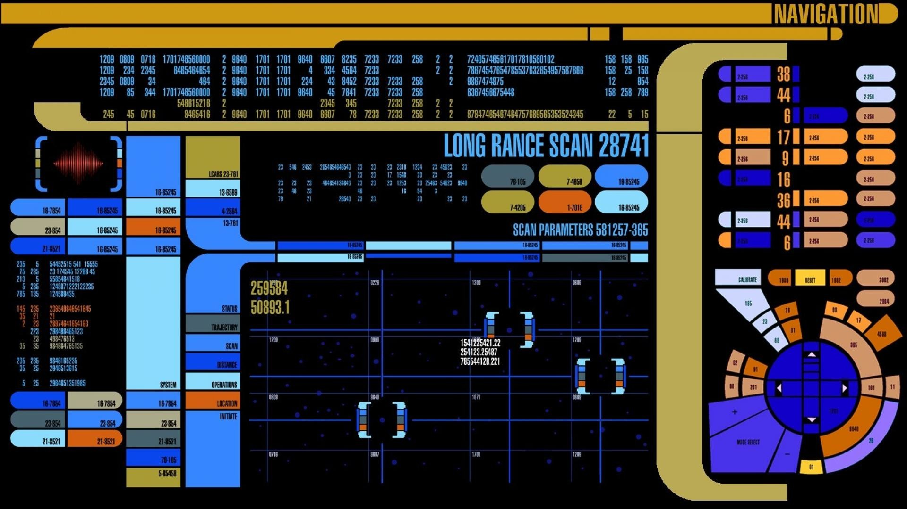

```{r setup, include=FALSE}
options(htmltools.dir.version = FALSE)
library(xaringan)
library(tidyverse)
library(tidymodels)
library(textrecipes)
library(gt)
#library()

computer <- readr::read_csv('https://raw.githubusercontent.com/rfordatascience/tidytuesday/master/data/2021/2021-08-17/computer.csv')

```

class: center, middle

# Welcome

### This is your first day of Computer Command Training!

---
class: inverse, center, middle

# Let's Get Started

---
class: middle, center
<picture of computer>


---
class: middle, center
# Wake word
## To wake the computer, say, **"Computer"**, and give a command.
### "Computer identify."
## You can also make a command followed immediately by "Computer."
### "Re-analyze, computer."


---
class: middle, center
# Conversation
## Once awake, the computer can converse with you.
### No need for the wake word.
## However, you need to be aware of non-verbal responses.

---
class: middle, center
# Avoiding errors
## There have been very few errors according to our records.
## They have occurred mostly due to receiver damage or weak signals.

---
class: middle, center
```{r echo=FALSE}
computer %>% 
  filter(name == "141" & between(value_id, 91, 113)) %>% 
  select(char, line, error) %>% 
  unique() %>% 
  gt() %>% 
  tab_header("Transaction between Data and Computer", "Mission 141") %>% 
  cols_label(char = md("**Name**"),
             line = md("**Line**"), 
             error = md("**Error?**")) %>% 
  tab_style(
    style = 
      list(cell_fill(color = "orange"),
           cell_text(weight = "bold")),
           locations = cells_body(rows = error == "TRUE")
    )
```


---
class: center, middle

# Other errors are of an unidentified origin.

???
Need more data
---
class: center, middle

```{r echo=FALSE}
computer %>% 
  filter(name == "193" & (value_id == "277" | value_id == "280")) %>% 
  select(char, line, error) %>% 
  unique() %>% 
  gt() %>% 
  tab_header("Transaction between Picard and Computer", "Mission 193") %>% 
  cols_label(char = md("**Name**"),
             line = md("**Line**"), 
             error = md("**Error?**")) %>% 
  tab_style(
    style = 
      list(cell_fill(color = "orange"),
           cell_text(weight = "bold")),
           locations = cells_body(rows = error == "TRUE")
    )
```

---
# Exploring the Computer communication data

---
class: middle, center


```{r, echo = F}
computer %>% 
  count(nv_resp, error) %>% 
  add_row(nv_resp = TRUE, error = TRUE, n = 0) %>% 
  pivot_wider(nv_resp, names_from = error, values_from = n) %>% 
  gt() %>% 
  tab_header("Errors of Non-Verbal Computer Responses") %>% 
  cols_label(nv_resp = "Non-verbal Response",
             `FALSE` = "Good",
             `TRUE` = "Error"
             ) #%>% 
  #tab_spanner("Error", c(`FALSE`, `TRUE`))
```

???
Non-verbal responses
---
class: center, middle

# [Type of words and non-verbal responses](https://twitter.com/FGazzelloni/status/1427764709357461504/photo/1)
By:Federica Gazzelloni (@FGazzelloni)

---
class: center, middle

# Total unique errors
```{r, echo = F}
computer_clean <- computer %>% 
  select(-c(type, sub_domain, direction)) %>% 
  #count(name, value_id, sort = T)
  unique()

unique_errors <- computer_clean %>% 
  count(error) 

only_errors <- unique_errors %>% filter(error == "TRUE") %>% select(n)

#unique_errors$n
```

## There were only **`r only_errors$n`** in the `r sum(unique_errors)` unique computer interactions.

---
class: middle, center
```{r, echo = F}
computer %>% 
  count(domain, sub_domain, error) %>% 
  arrange(desc(n)) %>% 
  filter(error == TRUE) %>% 
  select(-error) %>% 
  replace_na(list(domain = "Unknown", sub_domain = "Unknown")) %>% 
  gt() %>% 
  tab_header("Errors within Domains") %>% 
  cols_label(domain = "Domain",
             sub_domain = "Sub-domain",
             #error = "Error",
             n = "Count")
```

???
Domain & Sub-domain
---

class: center, middle

# [Most common interaction by domain](https://twitter.com/isitmanu/status/1428018552796327942/photo/1)
By: Manu Alcala Kovalski (@isitmanu)

---
class: middle, center

```{r, echo = F}
computer %>% 
  count(type, pri_type, error) %>% 
  arrange(desc(n)) %>% 
  filter(error == TRUE) %>% 
  select(-error) %>% 
  replace_na(list(type = "Unknown", pri_type = "Unknown")) %>% 
  gt() %>% 
  tab_header("Errors within Types") %>% 
  cols_label(type = "Type",
             pri_type = "Primary Type",
             #error = "Error",
             n = "Count")
```


???
Primary Type and Type
---
class: middle, center


```{r, echo=F}
computer %>% 
  count(char_type, char, error) %>% 
  arrange(desc(n)) %>% 
  filter(error == TRUE) %>% 
  select(-error) %>% 
  #replace_na(list(type = "Unknown", pri_type = "Unknown")) %>% 
  gt() %>% 
  tab_header("Errors by Character") %>% 
  cols_label(char_type = "Character Type",
             char = "Character Name",
             #error = "Error",
             n = "Count")


# computer %>% 
#   count(char, error) %>% 
#   arrange(desc(n)) %>% 
#   filter(error == TRUE) %>% 
#   select(-error) %>% 
#   #replace_na(list(type = "Unknown", pri_type = "Unknown")) %>% 
#   gt() %>% 
#   tab_header("Errors by Character Name") %>% 
#   cols_label(char = "Character Name",
#              #pri_type = "Primary Type",
#              #error = "Error",
#              n = "Count")
```
???
- Speaker (person)

---
class: center, middle

# [Who is speaking?](https://twitter.com/moriah_taylor58/status/1428528721317744640/photo/1)
By: Moriah Taylor (@moriah_taylor58)

---
class: middle, center
# Learning about the errors
### With over 1300 unique human-computer transactions, only 6 contained errors
### We used the computer to analyze its errors.

---
class: middle
# ML confirmed our exploration
## Error are caused by: 
- weak signals, 
- system damage, or
- unclear dialogue


???
## We find that our models provide decent information about what to avoid
---

class: center, middle


```{r echo=F, message=FALSE, warning=FALSE, error=FALSE, tidy=TRUE}


computer_model <- computer_clean %>% 
  select(line, domain, nv_resp, pri_type, domain, error) %>% 
  mutate(across(domain:error, ~as.factor(.)))

set.seed(345678)

computer_split <- initial_split(computer_model, prop = .75, strata = error)

computer_other <- training(computer_split)
computer_test <- testing(computer_split)

# SEVERELY IMBALANCED DATA!!

val_set <- validation_split(computer_other,
                            strata = error,
                            prop = .75)

train_4fold <- computer_other %>% 
  vfold_cv(4, strata = error)

lr_mod <-
  logistic_reg(penalty = tune(), mixture = 1) %>% 
  set_engine("glmnet")

####


lr_recipie <-
  recipe(error ~ ., data = computer_other) %>% 
  step_impute_mode(all_predictors()) %>%
  step_novel(line, domain, pri_type) %>%
  themis::step_upsample(error, over_ratio = .5) %>% #The imbalance is so bad, I don't know what the right ratio should be. It's literally 1:1000!
  step_dummy(domain, nv_resp, pri_type, domain) %>% 
  step_tokenize(line) %>% 
  #step_stem(line) %>% 
  textrecipes::step_stopwords(line) %>% # I had to install a "stopwords" package.
  step_tokenfilter(line, max_tokens = 10) %>% 
  #step_tfidf(line) %>% 
  step_tf(line)

lr_wf <-
  workflow() %>% 
  add_model(lr_mod) %>% 
  add_recipe(lr_recipie)


lr_reg_grid <- tibble(penalty = 10^seq(-4, -1, length.out = 30))

lr_result <- lr_wf %>% 
  tune_grid(val_set,
            grid = lr_reg_grid,
            control = control_grid(save_pred = T),
            metrics = metric_set(roc_auc))

# lr_result %>% 
#   collect_metrics() %>% 
#   arrange(mean)

lr_fit <- lr_wf %>% 
  finalize_workflow(select_best(lr_result)) %>% 
  fit(computer_other)


xg_mod <- 
  boost_tree(trees = tune(),
             mtry = tune(),
             tree_depth = tune(),
             learn_rate = tune()) %>% 
  set_mode("classification") %>% 
  set_engine("xgboost", eval_metric = "logloss")

xg_wf <- workflow() %>% 
  add_recipe(lr_recipie) %>% 
  add_model(xg_mod)

control_xg <- control_grid(save_workflow = T,
                           save_pred = T,
                           extract = extract_model)


xg_tune <- xg_wf %>% 
  tune_grid(train_4fold,
            metrics = metric_set(roc_auc),
            control = control_xg,
            grid = crossing(trees = seq(50, 500, 25),
                            mtry = c(2,3,4),
                            tree_depth = c(5),
                            learn_rate = c(0.018, .02)))


xg_fit <- xg_wf %>% 
  finalize_workflow(select_best(xg_tune)) %>% 
  fit(computer_other)

# xg_fit %>% 
#   augment(computer_test, type.predict = "prob") %>% 
#   roc_auc(error, .pred_FALSE) %>% 
#   mutate(Method = "XGboost") %>% 
#   select(Method, .estimate)

lr_fit %>% 
  augment(computer_test, type.predict = "prob") %>% 
  roc_auc(error, .pred_FALSE) %>% 
  mutate(Method = "Logistic Regression") %>% 
  select(Method, .estimate) %>% 
  bind_rows(xg_fit %>% 
    augment(computer_test, type.predict = "prob") %>% 
    roc_auc(error, .pred_FALSE) %>% 
    mutate(Method = "XGboost") %>% 
    select(Method, .estimate)) %>% 
  gt() %>% 
  tab_header("ROC of Best Fitting Models") %>% 
  cols_label(.estimate = "ROC") %>% 
  fmt_number(.estimate)
```


???
ML chart
What is ROC_AUC: 
- specificity:
- sensitivity:
---
class: center, middle

```{r, echo = F}
importances <- xgboost::xgb.importance(model = extract_fit_engine(xg_fit))

importances %>%
  mutate(Feature = fct_reorder(Feature, Gain)) %>%
  slice_head(n = 10) %>% 
  ggplot(aes(Gain, Feature)) +
  geom_col()
```

---
class: middle
# Reminders

- Speak clearly  
- Use the wake word  
- Keep systems at optimal levels

---
class: middle, center

# Live long and prosper